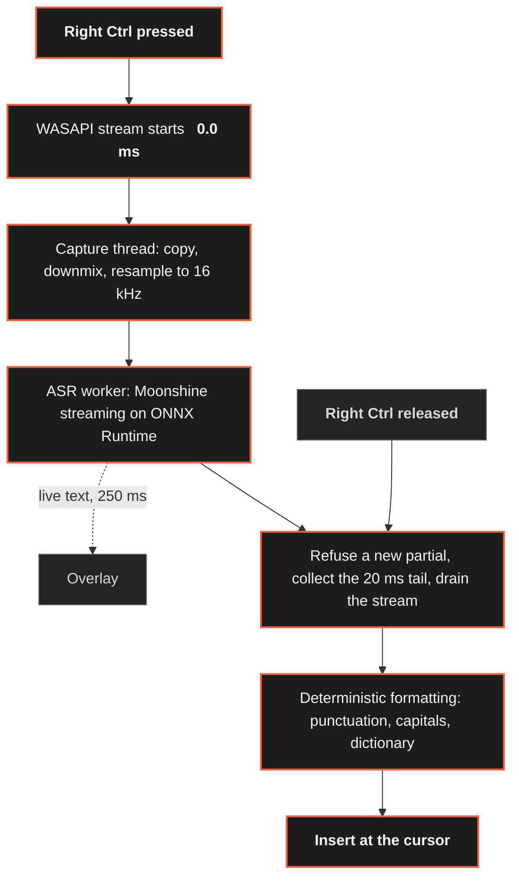

# Flow

An unapologetic alternative to cloud dictation. Ultra light, heavily optimised,
and your voice never leaves the machine.

Hold a key, talk, let go. The text appears wherever your cursor is.

<p align="center">
  
</p>

<p align="center">
  <a href="https://github.com/A-Snegin/flow-dictation/releases/latest"></a>
  
  
  
  
</p>

Every cloud dictation tool sends your voice to somebody else's computer. Flow
does the recognition on your own CPU. There is no account, no upload and no
subscription, and it works with no network connection at all.

On a 15 watt laptop chip:

- **221 ms** from releasing the key to text on screen, on the fast model
- **0.0%** idle CPU, and one core in use while working
- **19 MB** installer, **220 MB** resident with the speech model held in memory
- **2 to 4 ms** from the hotkey to a running microphone
- No browser engine, no UI toolkit, no background service, no telemetry

Local recognition has a reputation for being slow, and most of that comes from
three habits: waiting for the sentence to end before starting work, loading the
model when the key is pressed, and handing the recogniser the whole recording in
one call. Flow loads the model at startup and feeds it while you are still
talking.

## Installing

One line in PowerShell:

```powershell
irm https://raw.githubusercontent.com/A-Snegin/flow-dictation/main/scripts/web-install.ps1 | iex
```

Or download [the installer](https://github.com/A-Snegin/flow-dictation/releases/latest)
and run it. Both install for the current user, so Windows does not ask for
administrator rights.

| Download | Size | |
|---|---:|---|
| `Flow-Setup.exe` | 19 MB | Fetches the speech model on first run |
| `Flow-Setup-with-model.exe` | 134 MB | Carries the model, for a machine that will be offline |

The installer is not code signed, so Windows shows "Windows protected your PC".
Choose More info, then Run anyway.

## Linux

Flow also runs on Hyprland, and on any Wayland compositor that speaks
wlr-layer-shell for the overlay. You need PipeWire, `wtype` and `wl-clipboard`
on the system already; Rust 1.90 to build.

```bash
scripts/fetch-runtime.sh     # Moonshine runtime into ~/.local/share/flow/moonshine
scripts/fetch-model.sh       # small-streaming-en into ~/.local/share/flow/models
scripts/install-linux.sh     # builds, installs flow-core, writes the systemd unit
```

`install-linux.sh` does not bind the hotkey or start the service; it prints
two lines to add to `~/.config/hypr/bindings.lua`:

```lua
o.bind("CONTROL_R", "Flow: hold to dictate", "flow-ctl down")
o.bind("CTRL + CONTROL_R", "Flow: release", "flow-ctl up", { release = true })
```

Reload Hyprland's config, then `systemctl --user enable --now flow.service`.

`flow-ctl` is a second, tiny binary just for this: it writes one line to
flow-core's control socket and exits, without linking Moonshine or ONNX
Runtime, so the round trip from a keypress is about 1.5 ms rather than the
4 ms `flow-core` itself would cost to map those libraries on every press.

There is no tray on Linux. `flow-ctl toggle|cancel|reload|report|quit` does
what the tray menu does on Windows, over the same control socket. `flow-core
--key <cmd>` does the same job and needs nothing but flow-core itself, so
it is the fallback if `flow-ctl` is not installed.

Settings live at `~/.config/flow/settings.toml`, the model and traces at
`~/.local/share/flow`. Both paths follow `XDG_CONFIG_HOME` and
`XDG_DATA_HOME` when set.

Insertion works as on Windows: paste into applications, type into terminals.
Paste puts the text on the clipboard for a moment, sends Ctrl+V, then puts
the old clipboard back. A clipboard history tool such as cliphist will see
the dictation, since nothing on Linux has an equivalent of the Windows
"exclude from clipboard history" flags. Set `insertion.mode = "type"` to
avoid the clipboard entirely; typing goes through `wtype` and costs about
4.5 ms a character, which is why it is not the default.

Measured on the same Ryzen 7 7735U under Omarchy, small model: ready in
150 ms after launch, 220 MB resident in one process, key release to text
19 ms when the recogniser has kept up with the sentence, 582 ms on a long
passage fed faster than speech. Mic arm to first sample 15 ms.

## Using it

Hold **Right Ctrl**, speak, and let go. The words go in at the cursor, in any
application.

Flow sits in the notification area. Right-click for settings, to pause it, or
to quit.

Say "comma", "full stop", "question mark", "new line" or "new paragraph" and
they arrive as punctuation. Sentences are capitalised for you.

## Speed

Measured on a Ryzen 7 7735U, a 15 watt laptop chip from 2022, while OneDrive
was using most of a core in the background. On a quiet machine it is faster.

| | Small model | Tiny model |
|---|---:|---:|
| Key release to text, median | 493 ms | **221 ms** |
| 95th percentile | 1070 ms | 380 ms |
| 99th percentile | 1210 ms | 414 ms |
| Real-time factor | 0.62 | 0.28 |
| Word error rate, clean speech | 5.0% | 3.4% |

Hotkey to a running microphone is 2 to 4 milliseconds. Idle CPU is 0.0%. The
process holds about 220 MB, nearly all of it the speech model.

Wispr Flow publishes a target of under 700 ms at the 99th percentile for its
cloud pipeline, of which up to 200 ms is budgeted for the network round trip.

Reproduce any of it:

```powershell
bench-e2e --holds 24                        # key-up latency distribution
wer --wav bench\corpus\two_cities_16k.wav --ref bench\corpus\two_cities.ref.txt
flow-core --mic-test 3                      # audio path
```

## How it works



Nothing on that path allocates a model, touches the disk, opens a socket or
waits on a thread. Capture teardown, clipboard restore and trace writing all
happen after the text is already on screen.

Flow runs five threads:

| Thread | Priority | Work |
|---|---|---|
| Message | normal | Keyboard hook, overlay at 25 fps while visible, tray, settings. Blocks until something happens. |
| Capture | multimedia | Copy the packet, downmix, resample. No allocation, no locks held over work. |
| ASR worker | above normal | One transcriber, one ONNX thread. Idle between utterances. |
| Clipboard restore | normal | Runs after the text is on screen. |
| Trace writer | normal | One JSON line per dictation, after the fact. |

## Design decisions

**The microphone opens at startup.** Opening the audio device costs 321 ms, so
doing it on key-down clipped the first word off every sentence. The device is
initialised once and only started when the key goes down, which measures 0.0 ms
with the first sample 4 ms later. A device that is open but not started is not
recording, so Windows shows no microphone indicator between dictations.

**The overlay paints after the microphone starts.** It used to paint first, and
drawing it took 231 ms before the microphone even started. That was speech the
recogniser never heard. Moving two lines of code fixed it.

**Inference runs on one thread.** ONNX Runtime spreads work across every core by
default. The models here are small enough that splitting the work costs more in
coordination than it saves. Real-time factor is unchanged at 0.28 against 0.31,
the 95th percentile improves, and Flow uses one core in place of eight. Word
error rate came out identical, checked against a reference transcript.

**The worker starts no new partial once the key is released.** A call to the
recogniser cannot be stopped once it has started. When you let go, you wait for
whatever call is running. Not starting another one is the only way to keep
that wait short.

There is no GPU path. Moonshine converts its models to
ORT format at full graph optimisation, which fuses whole regions into
`com.microsoft` CPU operators. No compiling execution provider recognises those,
and because they sit in the middle of the graph the model splits into dozens
of pieces.
Upstream measured fewer than seven nodes per partition on every model they
tested. On this workload the CPU is faster.

## Privacy

Your voice stays on the machine. No audio is ever written to disk. It is held
in memory for as long as it takes to recognise.

| | |
|---|---|
| `%APPDATA%\Flow\settings.toml` | settings and dictionary |
| `%LOCALAPPDATA%\Flow\traces.jsonl` | timings and a character count, never the text |
| `%LOCALAPPDATA%\Flow\models` | the speech model |

Pasting puts the text on the Windows clipboard for a moment. Clipboard History
(Win+V) would keep a copy and sync it to a Microsoft account if that is enabled,
so every paste is marked `CanIncludeInClipboardHistory = 0`,
`CanUploadToCloudClipboard = 0` and
`ExcludeClipboardContentFromMonitorProcessing`. The previous clipboard contents
are restored afterwards. Setting insertion to Type avoids the clipboard
entirely.

Flow prints how many characters it inserted, never the words. Anything that
captures the program's output would otherwise save what you said to a file.
`FLOW_ECHO=1` turns the text back on when you are debugging.

## Settings

Right-click the tray icon, Open settings. Everything applies on save, including
the hotkey and the model, so nothing needs a restart. Editing
`%APPDATA%\Flow\settings.toml` in a text editor works equally well; the file is
watched.

Names, companies, products and acronyms are what a recogniser gets wrong most
often. The dictionary does two jobs from one list: Flow gives your terms to the
recogniser while it listens, so it is more likely to get them right, and the
same list fixes the text afterwards when it did not.

```
Lift-Off Consulting        a term to recognise, written as typed
lift off = Lift-Off        heard on the left, written on the right
```

Check what an entry does to a phrase without dictating it:

```powershell
flow-core --dictionary "we met the lift off consulting team about dddm"
```

## Terminals

Dictating into PowerShell, cmd or Windows Terminal is handled separately from
dictating into a document.

Paste keybindings vary between consoles and are sometimes disabled, so in a
terminal Flow types the text out as keystrokes instead, which works anywhere.

In a terminal, line breaks are turned into spaces. A line break at a shell
prompt is the Enter key, so without that, saying "new paragraph" while typing a
command would run it. Add your own shells under `insertion.terminal_apps` if you
use one outside the built-in list.

## Diagnostics

```powershell
flow-core --mic-test 3          # device open cost, arm cost, sample rate, level
flow-core --dictate 5           # one dictation, printed instead of inserted
flow-core --which-app           # what has focus and how text would go into it
flow-core --dictionary "text"   # what the dictionary does to a phrase
flow-core --overlay-demo 8      # drive the overlay without speaking
bench-e2e --holds 24            # key-up to transcript, percentiles
wer --wav <file> --ref <text>   # word error rate over the streaming path
```

Latency for every dictation lands in `%LOCALAPPDATA%\Flow\traces.jsonl`, one
JSON line each, timings only.

## Building

Rust 1.90 and Visual Studio 2022 with the C++ tools.

```powershell
.\scripts\fetch-runtime.ps1     # Moonshine runtime, 26 MB, outside the source tree
.\scripts\fetch-model.ps1       # small-streaming-en, 142 MB
cargo build --release
cargo test --release
.\scripts\install.ps1           # binaries on PATH, Desktop launcher
```

Packaging:

```powershell
.\scripts\build-installer.ps1              # 19 MB
.\scripts\build-installer.ps1 -WithModel   # 134 MB
```

## Built on

Speech recognition by [Moonshine](https://github.com/moonshine-ai/moonshine),
whose streaming English models and C library do the recognition, under MIT.
Inference by [ONNX Runtime](https://github.com/microsoft/onnxruntime). The rest
is Rust and Win32, with no UI toolkit and no browser engine.

See [THIRD-PARTY-NOTICES.md](THIRD-PARTY-NOTICES.md).

## Licence

MIT. See [LICENSE](LICENSE).
