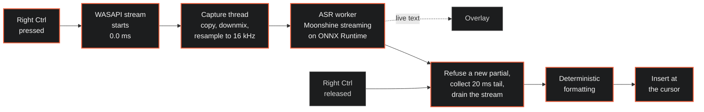
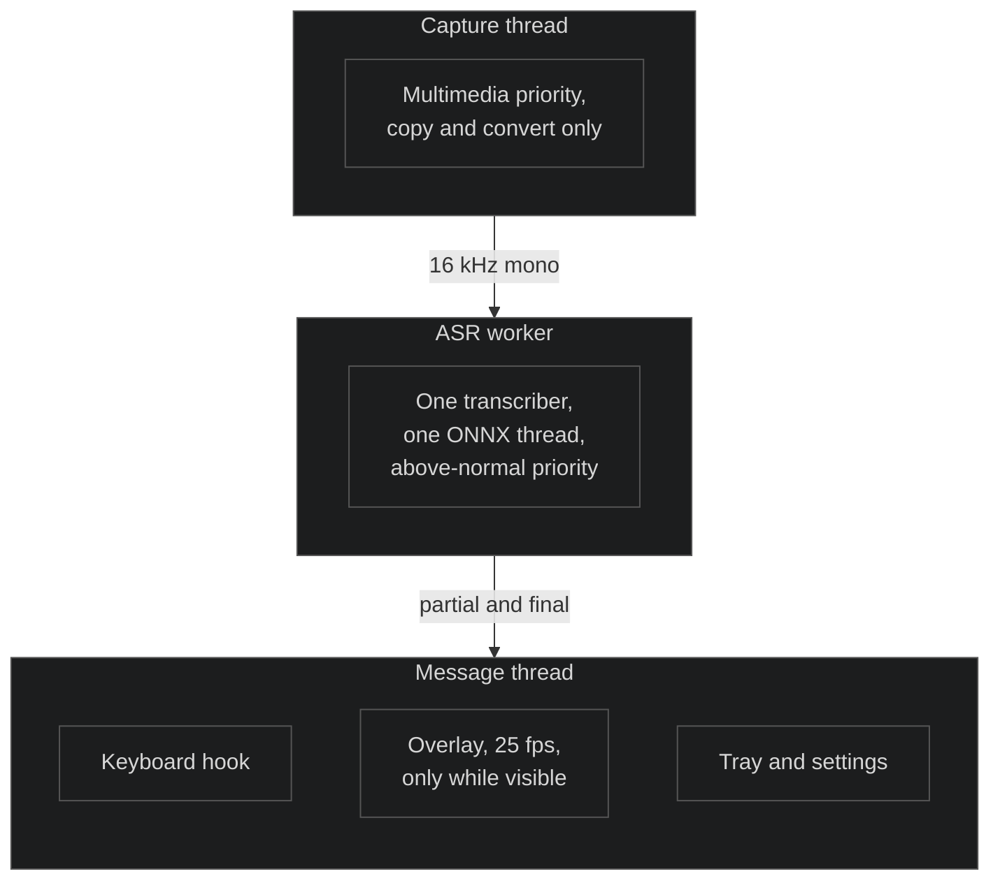
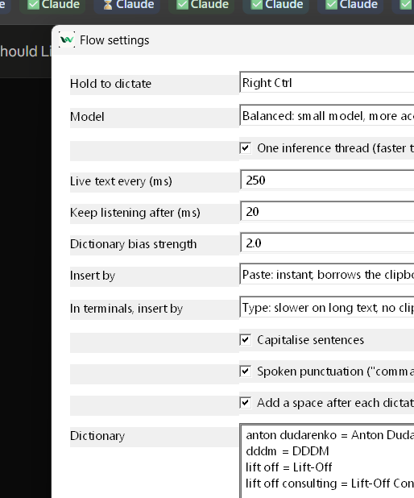

# Flow

Dictation that runs on your own machine. Hold a key, talk, let go, and the text
is in whatever you were typing into.

<p align="center">
  
</p>

<p align="center">
  <a href="https://github.com/A-Snegin/flow-dictation/releases/latest"></a>
  
  
  
  
</p>

Every cloud dictation tool sends your voice to somebody else's computer. Flow
does the recognition here, on the CPU you already own. There is no account, no
upload, no subscription, and no network traffic of any kind while you dictate.
Pull the ethernet cable out and it behaves the same.

Local recognition has a reputation for being slow. On a mid-range laptop the
wait between releasing the key and seeing the text is around a third of a
second.

## Installing

One line in PowerShell:

```powershell
irm https://raw.githubusercontent.com/A-Snegin/flow-dictation/main/scripts/web-install.ps1 | iex
```

Or download [the installer](https://github.com/A-Snegin/flow-dictation/releases/latest)
and run it. Both install for the current user, so Windows does not ask for
administrator rights.

| Download | Size | |
|---|---:|---|
| `Flow-Setup.exe` | 19 MB | Fetches the speech model on first run |
| `Flow-Setup-with-model.exe` | 134 MB | Carries the model, for a machine that will be offline |

The installer is not code signed, so Windows shows "Windows protected your PC".
Choose More info, then Run anyway.

## Using it

Hold **Right Ctrl**, speak, and let go. The words go in at the cursor, in any
application.

Flow sits in the notification area. Right-click for settings, to pause it, or
to quit.

Say "comma", "full stop", "question mark", "new line" or "new paragraph" and
they arrive as punctuation. Sentences are capitalised for you.

## Speed

Measured on a Ryzen 7 7735U, a 15 watt laptop chip from 2022, while OneDrive was
using most of a core in the background.

| | Small model | Tiny model |
|---|---:|---:|
| Key release to text, median | 493 ms | **221 ms** |
| 95th percentile | 1070 ms | 380 ms |
| 99th percentile | 1210 ms | 414 ms |
| Real-time factor | 0.62 | 0.28 |
| Word error rate, clean speech | 5.0% | 3.4% |

Hotkey to a running microphone is 2 to 4 milliseconds. Idle CPU is 0.0%. The
process holds about 220 MB, nearly all of it the speech model, which stays in
memory so that pressing the key loads nothing.

Wispr Flow publishes a target of under 700 ms at the 99th percentile for its
cloud pipeline, of which up to 200 ms is budgeted for the network round trip.

Reproduce any of it:

```powershell
bench-e2e --holds 24                        # key-up latency distribution
wer --wav bench\corpus\two_cities_16k.wav --ref bench\corpus\two_cities.ref.txt
flow-core --mic-test 3                      # audio path
```

## How it works



Nothing on that path allocates a model, touches the disk, opens a socket or
waits on a thread. Capture teardown, clipboard restore and trace writing all
happen after the text is already on screen.

Five threads, four of them asleep almost all the time:



## Design decisions

Four decisions carry most of the speed. Each contradicted the obvious choice.

**The microphone opens at startup.** Opening the audio device costs 321 ms, so
doing it on key-down clipped the first word off every sentence. The device is
initialised once and only started when the key goes down, which measures 0.0 ms
with the first sample 4 ms later. An initialised, stopped client is not capturing, so
there is still no microphone indicator sitting in the system tray all day.

**The overlay paints after the microphone starts.** It used to paint first, and
an `UpdateLayeredWindow` on a topmost window is not free: traces showed 231 ms
between the key press and the first audio sample. Reordering two statements
recovered a quarter of a second of speech per dictation.

**Inference runs on one thread.** ONNX Runtime spreads work across every core by
default. For graphs this small that buys nothing and costs tail latency in
thread-pool synchronisation. Real-time factor is unchanged at 0.28 against 0.31,
the 95th percentile improves, and Flow uses one core in place of eight. Word
error rate came out identical, checked against a reference transcript.

**The worker declines to start a partial once the key is released.** The
recogniser cannot cancel a call in flight. Refusing to begin one is the only
bound available on how long key-up waits.

There is no GPU path. Moonshine converts its models to
ORT format at full graph optimisation, which fuses whole regions into
`com.microsoft` CPU operators. No compiling execution provider recognises those,
and because they sit mid-graph the model shatters into dozens of fragments.
Upstream measured fewer than seven nodes per partition on every model they
tested. For this workload the CPU is the fast path.

## Privacy

Your voice stays on the machine. No audio is written to disk at any point; it
exists in memory for as long as it takes to recognise.

| | |
|---|---|
| `%APPDATA%\Flow\settings.toml` | settings and dictionary |
| `%LOCALAPPDATA%\Flow\traces.jsonl` | timings and a character count, never the text |
| `%LOCALAPPDATA%\Flow\models` | the speech model |

Two details worth stating plainly.

Pasting puts the text on the Windows clipboard for a moment. Clipboard History
(Win+V) would keep a copy and sync it to a Microsoft account if that is enabled,
so every paste is marked `CanIncludeInClipboardHistory = 0`,
`CanUploadToCloudClipboard = 0` and
`ExcludeClipboardContentFromMonitorProcessing`. The previous clipboard contents
are restored afterwards. Setting insertion to Type avoids the clipboard
entirely.

Flow never prints what was dictated. It reports a length. Anything that
redirects the process would otherwise write your dictation into a file.
`FLOW_ECHO=1` brings the text back when you are debugging.

## Settings

<p align="center">
  
</p>

Right-click the tray icon, Open settings. Everything applies on save, including
the hotkey and the model, so nothing needs a restart. Editing
`%APPDATA%\Flow\settings.toml` in a text editor works equally well; the file is
watched.

The dictionary does two jobs from one list. Terms are given to the recogniser
while it listens, so it is more likely to produce them, and the same list
corrects the output afterwards if it did not. Names, companies, products and
acronyms are what a recogniser gets wrong, and they are the errors a reader
notices.

```
Lift-Off Consulting        a term to recognise, written as typed
lift off = Lift-Off        heard on the left, written on the right
```

Check what an entry does to a phrase without dictating it:

```powershell
flow-core --dictionary "we met the lift off consulting team about dddm"
```

## Terminals

Dictating into PowerShell, cmd or Windows Terminal is handled separately from
dictating into a document.

Paste keybindings vary between consoles and are sometimes disabled, so terminals
receive synthesised Unicode keystrokes, which work anywhere a console reads
input.

Line breaks become a space. At a shell prompt a line break is the Enter key, so
dictating "new paragraph" while composing a command would run it. That cannot
happen. Add your own shells under `insertion.terminal_apps` if you use one
outside the built-in list.

## Diagnostics

Every claim above has a command behind it.

```powershell
flow-core --mic-test 3          # device open cost, arm cost, sample rate, level
flow-core --dictate 5           # one dictation, printed instead of inserted
flow-core --which-app           # what has focus and how text would go into it
flow-core --dictionary "text"   # what the dictionary does to a phrase
flow-core --overlay-demo 8      # drive the overlay without speaking
bench-e2e --holds 24            # key-up to transcript, percentiles
wer --wav <file> --ref <text>   # word error rate over the streaming path
```

Latency for every dictation lands in `%LOCALAPPDATA%\Flow\traces.jsonl`, one
JSON line each, timings only.

## Building

Rust 1.90 and Visual Studio 2022 with the C++ tools.

```powershell
.\scripts\fetch-runtime.ps1     # Moonshine runtime, 26 MB, outside the source tree
.\scripts\fetch-model.ps1       # small-streaming-en, 142 MB
cargo build --release
cargo test --release
.\scripts\install.ps1           # binaries on PATH, Desktop launcher
```

Packaging:

```powershell
.\scripts\build-installer.ps1              # 19 MB
.\scripts\build-installer.ps1 -WithModel   # 134 MB
```

## Built on

Speech recognition by [Moonshine](https://github.com/moonshine-ai/moonshine),
whose streaming English models and C library do the recognition, under MIT.
Inference by [ONNX Runtime](https://github.com/microsoft/onnxruntime). The rest
is Rust and Win32, with no UI toolkit and no browser engine.

See [THIRD-PARTY-NOTICES.md](THIRD-PARTY-NOTICES.md).

## Licence

MIT. See [LICENSE](LICENSE).
